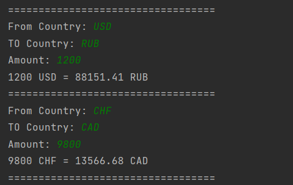
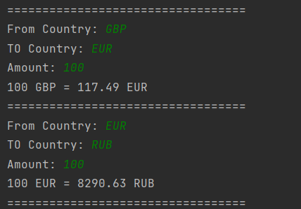

# Currency Converter
This application allows you to convert currency using Fixer.io Api.
You have up to 170 currencies available

## Commands
- from country: ``rates, for example USD, EUR, GBP...`` or to exit `-exit`
- to country: ``rates, for example CAD, RUB, CHF...``
- amount: ``integer value``

## API
https://fixer.io/

## Demonstration

## Docker
1) Download the project to yourself.
2) Run command: 
   - docker build -t currency-converter .
   - docker run -it temperature-converter

## Testing
* main 
* 

* dev 

